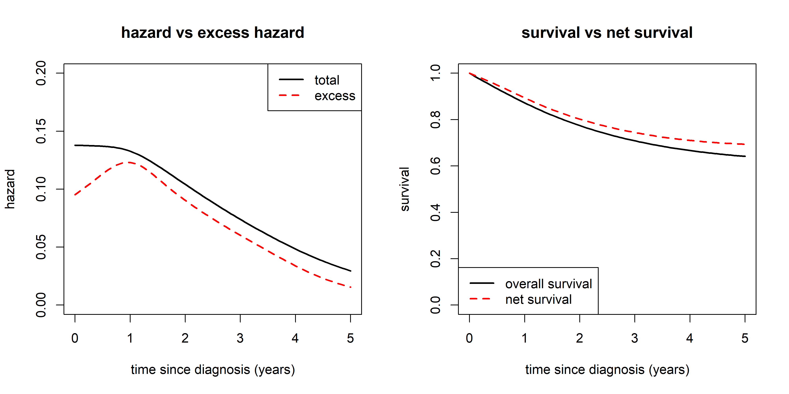
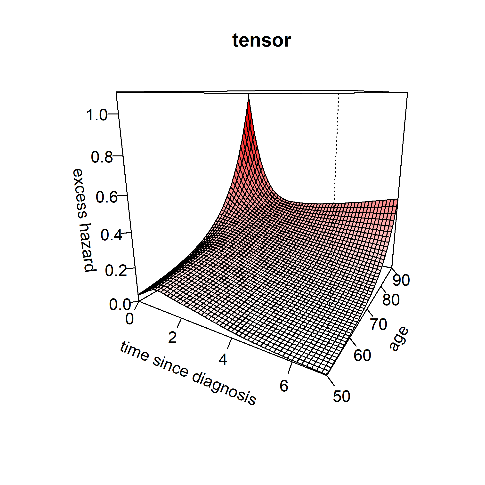

# survPen
## hazard and excess hazard modelling with multidimensional penalized splines
[](https://travis-ci.org/fauvernierma/survPen)
[](https://codecov.io/github/fauvernierma/survPen?branch=master)
[](https://zenodo.org/badge/latestdoi/181266005)


In survival and net survival analysis, in addition to modelling the effect of time (via the baseline hazard), 
one has often to deal with several continuous covariates and model their functional forms, their time-dependent 
effects, and their interactions. Model specification becomes therefore a complex problem and penalized regression 
splines represent an appealing solution to that problem as splines offer the required 
flexibility while penalization limits overfitting issues. 

Current implementations of penalized survival models can be slow or unstable and sometimes lack some key features 
like taking into account expected mortality to provide net survival and excess hazard estimates. In contrast, 
survPen provides an automated, fast, and stable implementation 
(thanks to explicit calculation of the derivatives of the likelihood) and offers a unified framework for 
multidimensional penalized hazard and excess hazard models.

`survPen` may be of interest to those who 1) analyse any kind of time-to-event data: mortality, disease relapse, 
machinery breakdown, unemployment, etc 2) wish to describe the associated hazard and to understand which predictors 
impact its dynamics.


You can install this R package from GitHub:


```r
install.packages("devtools")
library(devtools)
install_github("fauvernierma/survPen")
```

or directly from the CRAN repository:


```r
install.packages("survPen")
```


## The functionalities of the `survPen` package are extensively detailed in the following vignette
Available from
[GitHub](https://htmlpreview.github.io/?https://github.com/fauvernierma/survPen/blob/master/inst/doc/survival_analysis_with_survPen.html)
or from [CRAN](https://cran.r-project.org/web/packages/survPen/vignettes/survival_analysis_with_survPen.html)


## Quick start

In the following section, we will use a simulated dataset that contains artificial data from 2,000 women 
diagnosed with cervical cancer between 1990 and 2010. End of follow-up is June 30th 2013.

Let's fit a penalized hazard model and a penalized excess hazard model. Without covariates for now.

```r
library(survPen)

f1 <- ~ smf(fu) # penalized natural cubic spline of time with 10 knots placed at the quantiles

mod.total <- survPen(f1,data=datCancer,t1=fu,event=dead,method="LAML")

mod.excess <- survPen(f1,data=datCancer,t1=fu,event=dead,expected=rate,method="LAML")
```

Now let's look at the predicted dynamics of the hazard (and excess hazard) as well as the predicted 
survival curve (and net survival curve)


```r
lwd1 = 2

# compare the predictions of the models
new.time <- seq(0,5,length=100)
pred.total <- predict(mod.total,data.frame(fu=new.time))
pred.excess <- predict(mod.excess,data.frame(fu=new.time))

# hazard vs excess hazard
par(mfrow=c(1,2))
plot(new.time,pred.total$haz,type="l",ylim=c(0,0.2),main="hazard vs excess hazard",
xlab="time since diagnosis (years)",ylab="hazard",lwd=lwd1)
lines(new.time,pred.excess$haz,col="red",lwd=lwd1,lty=2)
legend("topright",legend=c("total","excess"),col=c("black","red"),lty=c(1,2), lwd=rep(lwd1,2))

plot(new.time,pred.total$surv,type="l",ylim=c(0,1),main="survival vs net survival",
xlab="time",ylab="survival",lwd=lwd1)
lines(new.time,pred.excess$surv,col="red",lwd=lwd1,lty=2)
legend("bottomleft",legend=c("overall survival","net survival"), col=c("black","red"), lty=c(1,2), lwd=rep(lwd1,2)) 
```



Now we want to include the effect of age at diagnosis on the excess hazard. The dynamics of the excess hazard 
may be different from one age to another. Therefore we need to take into account an interaction between time and age.
Thus, let's fit a penalized tensor product spline of time and age 


```r
f.tensor <- ~ tensor(fu,age) # penalized tensor product spline of time and age with 5*5 = 25 knots placed 
# at the quantiles

mod.tensor <- survPen(f.tensor,data=datCancer,t1=fu,event=dead,expected=rate)

summary(mod.tensor)
#> penalized excess hazard model 
#>  
#> Call:
#> survPen(formula = f.tensor, data = datCancer, t1 = fu, event = dead, 
#>     expected = rate)
#> 
#> Coefficients:
#>             Estimate Std. Error z value  Pr(>|z|)    
#> (Intercept) -3.42360    0.19153 -17.875 < 2.2e-16 ***
#> ---
#> Signif. codes:  0 '***' 0.001 '**' 0.01 '*' 0.05 '.' 0.1 ' ' 1
#> 
#> likelihood= -2042.38 , penalized likelihood= -2045.62
#> Number of parameters= 25 , effective degrees of freedom= 10.5342
#> LAML = 2055.64 
#>  
#> Smoothing parameter(s):
#> tensor(fu,age).1 tensor(fu,age).2 
#>          0.66055         39.46194 
#> 
#> edf of smooth terms:
#> tensor(fu,age) 
#>       9.534214 
#> 
#> converged= TRUE
```

Now let's predict the excess hazard surface


```r
new.age <- seq(50,90,length=50)
new.time <- seq(0,5,length=50)

Z.tensor <- outer(new.time,new.age,function(t,a) predict(mod.tensor,data.frame(fu=t,age=a))$haz)

# color settings
col.pal <- colorRampPalette(c("white", "red"))
colors <- col.pal(100)

facet <- function(z){

    facet.center <- (z[-1, -1] + z[-1, -ncol(z)] + z[-nrow(z), -1] + z[-nrow(z), -ncol(z)])/4
    cut(facet.center, 100)
    
}

theta1 = 30
zmax=1.1

# plot the hazard surface
par(mfrow=c(1,1))
persp(new.time,new.age,Z.tensor,col=colors[facet(Z.tensor)],main="tensor",theta=theta1,
xlab="\n time since diagnosis",ylab="\n age",zlab="\n excess hazard",
ticktype="detailed",zlim=c(0,zmax))
```




## Contributing

File an issue [here](https://github.com/fauvernierma/survPen/issues) if there is a feature, or a dataset, that you think is missing from the package, or better yet submit a pull request!

Please note that the `survPen` project is released with a [Contributor Code of Conduct](.github/CODE_OF_CONDUCT.md). By contributing to this project, you agree to abide by its terms.

## Citing 

If using `survPen` please consider citing the package in the relevant work. Citation information can be generated in R using the following (after installing the package),


```r
citation("survPen")
#> 
#> To cite survPen in publications use:
#> 
#>   Mathieu Fauvernier, Laurent Remontet, Zoe Uhry, Nadine Bossard,
#>   Laurent Roche and the CENSUR working survival group (2019).
#>   survPen: an R package for hazard and excess hazard modelling
#>   with multidimensional penalized splines in revision in the
#>   Journal of Open Source Software
#> 
#> A BibTeX entry for LaTeX users is
#> 
#>   @Article{,
#>     title = {survPen: an R package for hazard and excess hazard modelling with multidimensional penalized splines},
#>     author = {Mathieu Fauvernier and Laurent Remontet and Zoe Uhry and Nadine Bossard and Laurent Roche and the CENSUR working survival group},
#>     journal = {in revision in the Journal of Open Source Software},
#>     year = {2019},
#>   }
```

You may also consider citing the method article:
Fauvernier, M., Roche, L., Uhry, Z., Tron, L., Bossard, N., Remontet, L. and the CENSUR Working Survival Group (in press). Multi-dimensional penalized hazard model with continuous covariates: applications for studying trends and social inequalities in cancer survival, 
Journal of the Royal Statistical Society, series C. doi: 10.1111/rssc.12368


